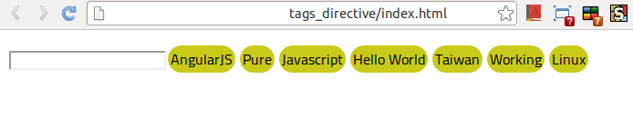

Tags Directive
==============

AngularJS Directive for Tags

### 1. Usage

You just include **`tags_directive.js`** and insert **`<input type="input" tags="m_tags"/>`** to index.html

That will look like this:

And add **`.tags_type`** to modify the style of tags

### 2. Live Demo

* [LiveDemo]( http://codepen.io/CarterTsai/pen/hLdwf "LiveDemo")
    

### 3. LICENSE

Copyright (c) 2013 Tsai Ming-Hsien (Carter Tsai)

Licensed under the MIT license.
